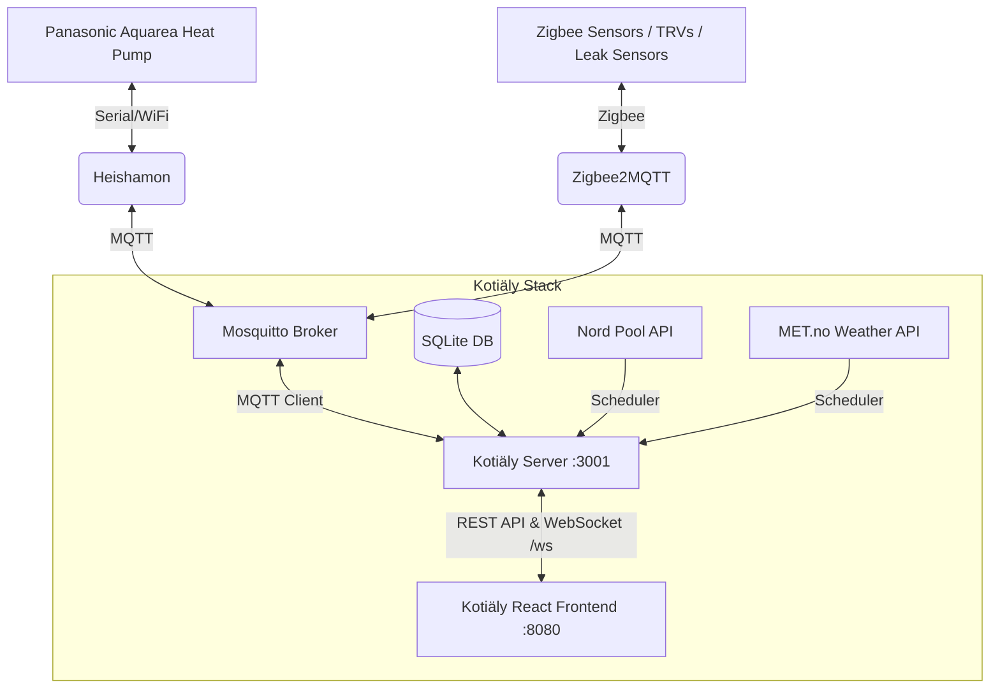

# 🏠 Kotiäly

**Kotiäly** is a modern, real-time home automation dashboard and monitoring platform tailored for **Panasonic Aquarea** heat pumps via **Heishamon**, combined with **Zigbee2MQTT** smart sensors, **Nord Pool** spot electricity pricing (Finland), and **MET.no** weather forecasts.

Built with a dark glassmorphic UI optimized for both desktop displays and mobile devices.

---

## 🌟 Key Features

- **🔥 Heat Pump Control & Monitoring (Panasonic Aquarea / Heishamon)**
  - Real-time compressor frequency, inlet/outlet/target temperatures, flow rates, and operating pressures.
  - Controls for Operating Modes (Heat, Cool, Auto, DHW, Combinations), Powerful Mode, Quiet Mode (Levels 1–3), and Holiday Mode.
  - Heat curve shift / Direct water temperature setpoint controls for buffer tank and heating circuit (Z1).
  - Domestic Hot Water (DHW) target temperature and instant boost/force controls.
  - Visual 3-way valve circuit status & flow diagram.
  - Real-time power production/consumption metrics with instant COP calculation.

- **⚡ Nord Pool Spot Electricity Pricing (Finland / FI)**
  - Real-time 15-minute resolution spot prices (c/kWh).
  - Daily minimum, average, and peak price tracking.
  - Smart window optimizer calculating the cheapest 3-hour and 6-hour heating slots.
  - 24-hour visual price forecast combined with outdoor temperature overlay.

- **🌤️ Local Weather Forecast (MET.no API)**
  - Live temperature, feels-like, wind speed, and humidity.
  - Hourly forecast (next 12–24 hours) with rain precipitation markers.
  - 5-day daily high/low summaries and condition symbols.

- **📡 Zigbee Smart Sensors (Zigbee2MQTT)**
  - Climate sensors: Room temperature, humidity, atmospheric pressure.
  - Door & Window contact sensors with tamper warnings and visual alert badges.
  - Thermostats & TRVs with heating demand percentages.
  - Water leak detection with immediate visual alarm alerts.
  - Battery percentages and link quality (LQI / signal bars) per device.

- **📱 Mobile-Optimized & Sleep/Wake Resilient**
  - Responsive layout for small screens (320px+).
  - Background/sleep reconnect watchdog to automatically revive WebSocket connections when mobile devices wake up.
  - Frame-buffered update batching to eliminate mobile CPU UI freezes during rapid MQTT message bursts.

---

## 🏗️ Architecture



---

## 🚀 Quick Start (Docker Compose)

The easiest way to run the entire stack (Mosquitto MQTT broker, Node.js backend, and Vite frontend) is with Docker Compose.

### 1. Clone & Configure Environment

```bash
git clone https://github.com/sukkamehu/Kotialy.git
cd Kotialy

# Copy sample configuration
cp .env.example .env
```

Edit `.env` to set secure passwords for the MQTT accounts:

```env
HEISHAMON_MQTT_USERNAME=heishamon
HEISHAMON_MQTT_PASSWORD=your_secure_heishamon_password
APP_MQTT_USERNAME=kotialy
APP_MQTT_PASSWORD=your_secure_app_password
ZIGBEE2MQTT_MQTT_USERNAME=zigbee2mqtt
ZIGBEE2MQTT_MQTT_PASSWORD=your_secure_z2m_password

MQTT_BASE_TOPIC=panasonic_heat_pump
ZIGBEE_BASE_TOPIC=zigbee2mqtt
```

### 2. Start the Stack

```bash
docker compose up -d
```

- **Dashboard UI**: `http://<your-host-ip>:8080`
- **Backend API & WebSocket**: `http://<your-host-ip>:3001`
- **MQTT Broker**: `1883` (LAN)

---

## 💻 Local Development

### Prerequisites
- Node.js 18+
- npm 9+

### Install Dependencies

```bash
npm run install:all
```

### Run Server and Client Concurrently

```bash
npm run dev
```

- Client runs at: `http://localhost:5173` (with proxy to backend at `:3001`)
- Server runs at: `http://localhost:3001`

### Build for Production

```bash
npm run build
```

---

## 📡 REST API & WebSocket Reference

### HTTP API Endpoints (`/api`)

| Endpoint | Method | Description |
|---|---|---|
| `/api/state` | `GET` | Current full snapshot of heat pump state and MQTT connection status |
| `/api/topics` | `GET` | List of all supported Heishamon topics, labels, units, and ranges |
| `/api/history?topic=...&hours=24` | `GET` | Historical recorded sensor metrics for a single topic |
| `/api/history/multi?topics=...&hours=24` | `GET` | Multi-topic history query for dashboard charts |
| `/api/command` | `POST` | Send command to heat pump (`{ setTopic, value }`) |
| `/api/nordpool/current` | `GET` | Current 15-minute spot price for Finland |
| `/api/nordpool/prices` | `GET` | Next 24h spot prices |
| `/api/nordpool/stats` | `GET` | Daily minimum, maximum, and average price |
| `/api/nordpool/cheapest?hours=3` | `GET` | Calculated optimal continuous heating window |
| `/api/weather/current` | `GET` | Live weather observation |
| `/api/weather/forecast?hours=24` | `GET` | Hourly weather forecast |
| `/api/weather/daily` | `GET` | 5-day weather summary |
| `/api/zigbee/devices` | `GET` | Discovered Zigbee device registry and live properties |
| `/api/zigbee/history` | `GET` | Historical readings for a Zigbee device property |

### WebSocket Endpoint (`/ws`)

The WebSocket provides real-time streaming updates:
- **`snapshot`**: Dispatched immediately upon client connection with complete heat pump and Zigbee state.
- **`state_update`**: Real-time MQTT topic updates from Heishamon.
- **`mqtt_status`**: Connection state change events.
- **`zigbee_update`**: Real-time property changes from Zigbee sensors.
- **`ping` / `pong`**: Heartbeat mechanism for connection health watchdog.

---

## 🛠️ Configuration & Ports

| Service | Port | Description |
|---|---|---|
| **Web Dashboard** | `8080` (Docker) / `5173` (Dev) | React web interface |
| **Backend API** | `3001` | Express REST API & WebSocket |
| **Mosquitto MQTT** | `1883` | MQTT Broker for Heishamon & Zigbee2MQTT |
| **MQTT WebSockets** | `9001` | Local loopback WebSocket MQTT port |

---

## 📄 License

MIT
