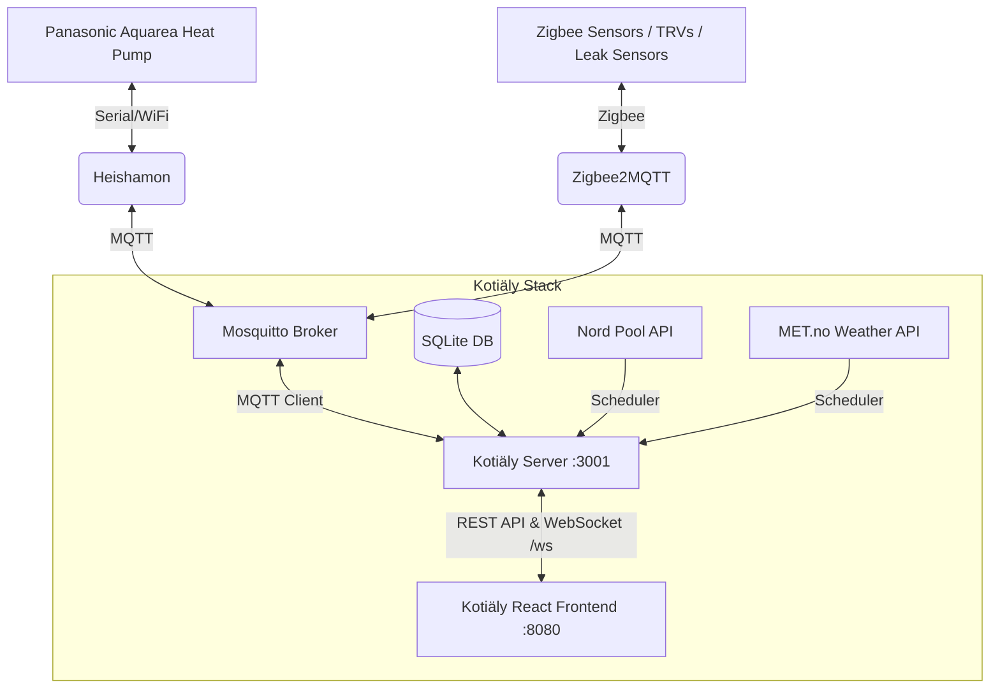

# 🏠 Kotiäly

**Kotiäly** is a modern, real-time home automation dashboard and monitoring platform tailored for **Panasonic Aquarea** heat pumps via **Heishamon**, combined with **Zigbee2MQTT** smart sensors, **Nord Pool** spot electricity pricing (Finland), and **MET.no** weather forecasts.

Built with a dark glassmorphic UI optimized for both desktop displays and mobile devices.

---

## 🌟 Key Features

- **🔥 Heat Pump Control & Monitoring (Panasonic Aquarea / Heishamon)**
  - Real-time compressor frequency, inlet/outlet/target temperatures, flow rates, and operating pressures.
  - Controls for Operating Modes (Heat, Cool, Auto, DHW, Combinations), Powerful Mode, Quiet Mode (Levels 1–3), and Holiday Mode.
  - Heat curve shift / Direct water temperature setpoint controls for buffer tank and heating circuit (Z1).
  - Domestic Hot Water (DHW) target temperature and instant boost/force controls.
  - Visual 3-way valve circuit status & flow diagram.
  - Real-time power production/consumption metrics with instant COP calculation.

- **🧠 APC · Älykäs Sähkön Hintaohjain (Auto Power & Price Controller)**
  - Dynamic 15-minute price optimization utilizing thermal storage tanks as thermal batteries.
  - **Puskurivaraajan esilämmitys (Boost)**: Halvoilla varttitunneilla nostaa lämmitystavoitetta (+2°C...+4°C) ja kalliilla huipuilla suorittaa säästöpudotuksen (-2°C...-3°C).
  - **Käyttöveden (DHW) latausaikataulu**: Etsii automaattisesti vuorokauden halvimman yhtenäisen jakson käyttövesivaraajan lämmitykselle.
  - **Monilaitearkkitehtuuri**: Valmis laiteajurirakenne nykyiselle Panasonic Aquarealle sekä tuleville Mitsubishi-ilmalämpöpumpuille (ILP 1 & 2).
  - **Käyttäjäohjaus**: Optimointiprofiilit (Tasapaino, Säästö, Mukavuus, Vain käyttövesi) ja manuaalinen ohitus/taukopainike (Override).

- **⚡ Nord Pool Spot Electricity Pricing (Finland / FI)**
  - Real-time 15-minute resolution spot prices (c/kWh).
  - Daily minimum, average, and peak price tracking.
  - Smart window optimizer calculating the cheapest 3-hour and 6-hour heating slots.
  - 24-hour visual price forecast combined with outdoor temperature overlay.

- **🌤️ Local Weather Forecast (MET.no API)**
  - Live temperature, feels-like, wind speed, and humidity.
  - Hourly forecast (next 12–24 hours) with rain precipitation markers.
  - 5-day daily high/low summaries and condition symbols.

- **📡 Zigbee Smart Sensors (Zigbee2MQTT)**
  - Climate sensors: Room temperature, humidity, atmospheric pressure.
  - Door & Window contact sensors with tamper warnings and visual alert badges.
  - Thermostats & TRVs with heating demand percentages.
  - Water leak detection with immediate visual alarm alerts.
  - Battery percentages and link quality (LQI / signal bars) per device.

- **📹 Teknisen tilan RTSP-valvontakamera**
  - Reaaliaikainen tilannekuva ja nopea videopäivitys suoraan kojelaudalla (1s, 3s, 10s tai pysäytetty).
  - ONVIF- ja RTSP-integraatio (TAS-Tech / EYEPLUS IP-kamera `192.168.68.57:554`).
  - Suoratoisto-osoitteet suoraan kopioitavissa: 1080p HD (`/0/av0`) ja nopea Sub stream (`/0/av1`).
  - Täysikokoinen katselutila ja automaattinen tilavahdin valvonta.

- **📱 Mobile-Optimized & Sleep/Wake Resilient**
  - Responsive layout for small screens (320px+).
  - Background/sleep reconnect watchdog to automatically revive WebSocket connections when mobile devices wake up.
  - Frame-buffered update batching to eliminate mobile CPU UI freezes during rapid MQTT message bursts.

---

## 🏗️ Architecture



---

## 🚀 Quick Start (Docker Compose)

The easiest way to run the entire stack (Mosquitto MQTT broker, Node.js backend, and Vite frontend) is with Docker Compose.

### 1. Clone & Configure Environment

```bash
git clone https://github.com/sukkamehu/Kotialy.git
cd Kotialy

# Copy sample configuration
cp .env.example .env
```

Edit `.env` to set secure passwords for the MQTT accounts:

```env
HEISHAMON_MQTT_USERNAME=heishamon
HEISHAMON_MQTT_PASSWORD=your_secure_heishamon_password
APP_MQTT_USERNAME=kotialy
APP_MQTT_PASSWORD=your_secure_app_password
ZIGBEE2MQTT_MQTT_USERNAME=zigbee2mqtt
ZIGBEE2MQTT_MQTT_PASSWORD=your_secure_z2m_password

MQTT_BASE_TOPIC=panasonic_heat_pump
ZIGBEE_BASE_TOPIC=zigbee2mqtt

# Remote Authentication & Roles (LAN access bypasses login with admin role automatically)
AUTH_USERNAME=admin
AUTH_PASSWORD=your_secure_remote_password
AUTH_VIEWER_USERNAME=viewer
AUTH_VIEWER_PASSWORD=your_secure_viewer_password
AUTH_SECRET=your_long_random_secret_string
AUTH_TOKEN_DAYS=365
```

> **Käyttäjäroolit (Roles):**
> - **Admin (`admin`)**: Täydet oikeudet lukea arvoja, muuttaa lämpötila-asetuksia, kytkeä tehostuksia ja ohjata laitteistoa.
> - **Vain luku / Katsoja (`viewer`)**: Sallii tilatietojen, antureiden, sääennusteiden ja pörssisähkön hintojen tarkastelun. Ohjauskomennot (`POST /api/command`) ja hintaparametrien muokkaus on estetty (403 Forbidden).

### 2. Start the Stack

```bash
docker compose up -d
```

- **Dashboard UI**: `http://<your-host-ip>:8080`
- **Backend API & WebSocket**: `http://<your-host-ip>:3001`
- **MQTT Broker**: `1883` (LAN)

---

## 💻 Local Development

### Prerequisites
- Node.js 18+
- npm 9+

### Install Dependencies

```bash
npm run install:all
```

### Run Server and Client Concurrently

```bash
npm run dev
```

- Client runs at: `http://localhost:5173` (with proxy to backend at `:3001`)
- Server runs at: `http://localhost:3001`

### Build for Production

```bash
npm run build
```

---

## 📡 REST API & WebSocket Reference

### HTTP API Endpoints (`/api`)

| Endpoint | Method | Description |
|---|---|---|
| `/api/state` | `GET` | Current full snapshot of heat pump state and MQTT connection status |
| `/api/topics` | `GET` | List of all supported Heishamon topics, labels, units, and ranges |
| `/api/history?topic=...&hours=24` | `GET` | Historical recorded sensor metrics for a single topic |
| `/api/history/multi?topics=...&hours=24` | `GET` | Multi-topic history query for dashboard charts |
| `/api/command` | `POST` | Send command to heat pump (`{ setTopic, value }`) |
| `/api/nordpool/current` | `GET` | Current 15-minute spot price for Finland |
| `/api/nordpool/prices` | `GET` | Next 24h spot prices |
| `/api/nordpool/stats` | `GET` | Daily minimum, maximum, and average price |
| `/api/nordpool/cheapest?hours=3` | `GET` | Calculated optimal continuous heating window |
| `/api/weather/current` | `GET` | Live weather observation |
| `/api/weather/forecast?hours=24` | `GET` | Hourly weather forecast |
| `/api/weather/daily` | `GET` | 5-day weather summary |
| `/api/zigbee/devices` | `GET` | Discovered Zigbee device registry and live properties |
| `/api/zigbee/history` | `GET` | Historical readings for a Zigbee device property |
| `/api/apc/status` | `GET` | Current APC state, active directive, device statuses, and plan |
| `/api/apc/plan` | `GET` | Computed 24h-36h 15-minute optimization plan |
| `/api/apc/settings` | `POST` | Update APC optimization parameters (Admin only) |
| `/api/apc/override` | `POST` | Set manual temporary override or snooze (Admin only) |
| `/api/apc/logs` | `GET` | History of automated optimization events |

### WebSocket Endpoint (`/ws`)

The WebSocket provides real-time streaming updates:
- **`snapshot`**: Dispatched immediately upon client connection with complete heat pump and Zigbee state.
- **`state_update`**: Real-time MQTT topic updates from Heishamon.
- **`mqtt_status`**: Connection state change events.
- **`zigbee_update`**: Real-time property changes from Zigbee sensors.
- **`ping` / `pong`**: Heartbeat mechanism for connection health watchdog.

---

## 🛠️ Configuration & Ports

| Service | Port | Description |
|---|---|---|
| **Web Dashboard** | `8080` (Docker) / `5173` (Dev) | React web interface |
| **Backend API** | `3001` | Express REST API & WebSocket |
| **Mosquitto MQTT** | `1883` | MQTT Broker for Heishamon & Zigbee2MQTT |
| **MQTT WebSockets** | `9001` | Local loopback WebSocket MQTT port |

---

## 🔥 Varavastus ja erikoisohjaukset (Heater & Force Controls)

Kotiäly mahdollistaa Panasonic Aquarean lisävastuksen ja erikoistilojen ohjaamisen suoraan käyttöliittymästä, REST API:lla tai MQTT-viesteillä.

### Ohjauskomennot MQTT:llä

| Toiminto | MQTT-komentoaihe (Set topic) | Arvot | Tilapalaute (State topic) |
|---|---|---|---|
| **Pakota lisävastus / varavastus (Force Heater)** | `panasonic_heat_pump/commands/SetForceHeater` | `1` = Päällä, `0` = Pois | `main/Force_Heater_State`, `main/Internal_Heater_State` |
| **Käyttöveden tehostus (Force DHW)** | `panasonic_heat_pump/commands/SetForceDHW` | `1` = Päällä, `0` = Pois | `main/Force_DHW_State`, `main/DHW_Heater_State` |
| **Pakkosulatus (Force Defrost)** | `panasonic_heat_pump/commands/SetForceDefrost` | `1` = Päällä, `0` = Pois | `main/Defrosting_State` |
| **Käyttötila (Operation Mode)** | `panasonic_heat_pump/commands/SetOperationMode` | `0`–`8` (ks. alla) | `main/Operating_Mode_State` |

#### Käyttötilojen arvot:
* `0` = Vain lämmitys
* `1` = Vain jäähdytys
* `2` = Auto (lämmitys)
* `3` = Vain käyttövesi
* `4` = **Lämmitys + Käyttövesi** (Suositeltu oletus)
* `5` = Jäähdytys + Käyttövesi
* `6` = Auto (lämmitys) + Käyttövesi
* `7` = Auto (jäähdytys)
* `8` = Auto (jäähdytys) + Käyttövesi

#### Esimerkkikomennot komentoriviltä:
```bash
# Pakota varavastus päälle
mosquitto_pub -h 192.168.68.51 -u kotialy -P <salasana> -t "panasonic_heat_pump/commands/SetForceHeater" -m "1"

# Pakota käyttöveden lämmitys/tehostus päälle
mosquitto_pub -h 192.168.68.51 -u kotialy -P <salasana> -t "panasonic_heat_pump/commands/SetForceDHW" -m "1"

# Vaihda toimintatilaksi Lämmitys + Käyttövesi
mosquitto_pub -h 192.168.68.51 -u kotialy -P <salasana> -t "panasonic_heat_pump/commands/SetOperationMode" -m "4"
```

> [!TIP]
> **Vianmääritys – Jos käyttövesivastuksen tila näyttää "Pois":**
> 1. Varmista Panasonicin omalta seinäohjaimelta asetus: **Valikko → Asennusvalikko (Installer setup) → Lämmin käyttövesi (DHW) → Säiliön vastus (Tank heater): Kyllä**.
> 2. Varmista, että toimintatilana on jokin käyttöveden sisältävä tila (esim. **Lämmitys + KV**, tila 4).

---

## 🔄 Automaattinen päivitys (Auto-Deploy Ubuntu / Linux)

Projektissa on mukana valmis skripti ([scripts/autodeploy.sh](file:///Users/sukkis/Dev/Kotiäly/scripts/autodeploy.sh)), joka tarkistaa Git-repositorion 10 minuutin välein ja deployaa uuden version automaattisesti, mikäli uusia committeja tai julkaisuja löytyy.

### Skriptin ominaisuudet:
- **Flock-lukitus**: Estää päällekkäiset ajot.
- **Automaattinen tunnistus**: Tunnistaa Docker Compose- ja paikallisasennukset automaattisesti.
- **Siivous**: Poistaa vanhat Docker-imaget päivityksen jälkeen automaattisesti.
- **Lokitus**: Tallentaa aikaleimatut tulosteet kansioon `logs/autodeploy.log`.

---

### Vaihtoehto A: Asennus Cronilla (Nopein ja helpoin)

1. Avaa crontab palvelimella:
   ```bash
   crontab -e
   ```
2. Lisää rivi (vaihda polku vastaamaan asennushakemistoasi):
   ```cron
   */10 * * * * /opt/kotialy/scripts/autodeploy.sh >> /opt/kotialy/logs/autodeploy.log 2>&1
   ```

---

### Vaihtoehto B: Asennus systemd Timerilla (Ubuntun suositus)

1. Varmista skriptin suoritusoikeudet:
   ```bash
   chmod +x scripts/autodeploy.sh
   ```

2. Kopioi systemd-palvelu ja ajastin:
   ```bash
   sudo cp scripts/kotialy-updater.service /etc/systemd/system/
   sudo cp scripts/kotialy-updater.timer /etc/systemd/system/
   ```

3. *(Valinnainen)* Tarkista ja muokkaa polut tiedostossa `/etc/systemd/system/kotialy-updater.service`:
   ```ini
   [Service]
   WorkingDirectory=/opt/kotialy
   ExecStart=/opt/kotialy/scripts/autodeploy.sh
   ```

4. Ota ajastus käyttöön ja käynnistä se:
   ```bash
   sudo systemctl daemon-reload
   sudo systemctl enable --now kotialy-updater.timer
   ```

5. Tarkista ajastimen tila ja seuraava suoritusaika:
   ```bash
   systemctl list-timers kotialy-updater.timer
   ```

6. Voit seurata päivityslokeja komennolla:
   ```bash
   journalctl -u kotialy-updater.service -f
   # tai
   tail -f logs/autodeploy.log
   ```

---

## 📄 License

MIT

